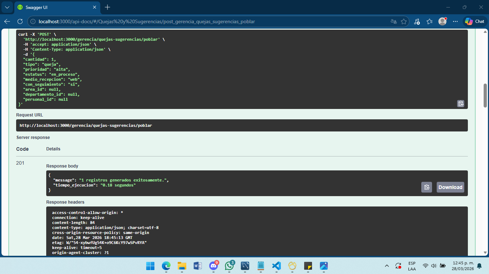
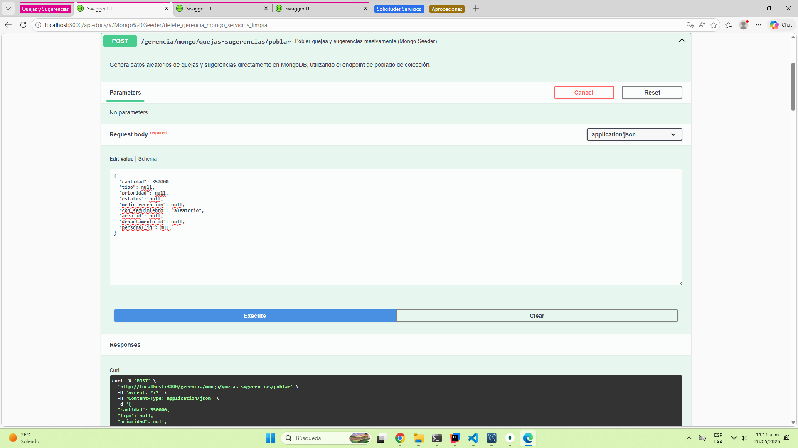
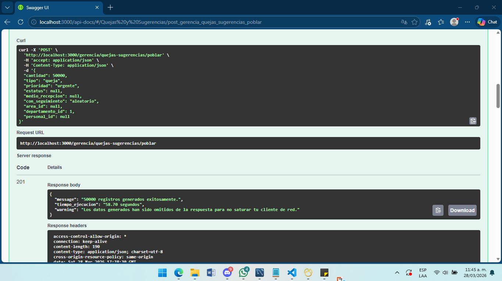
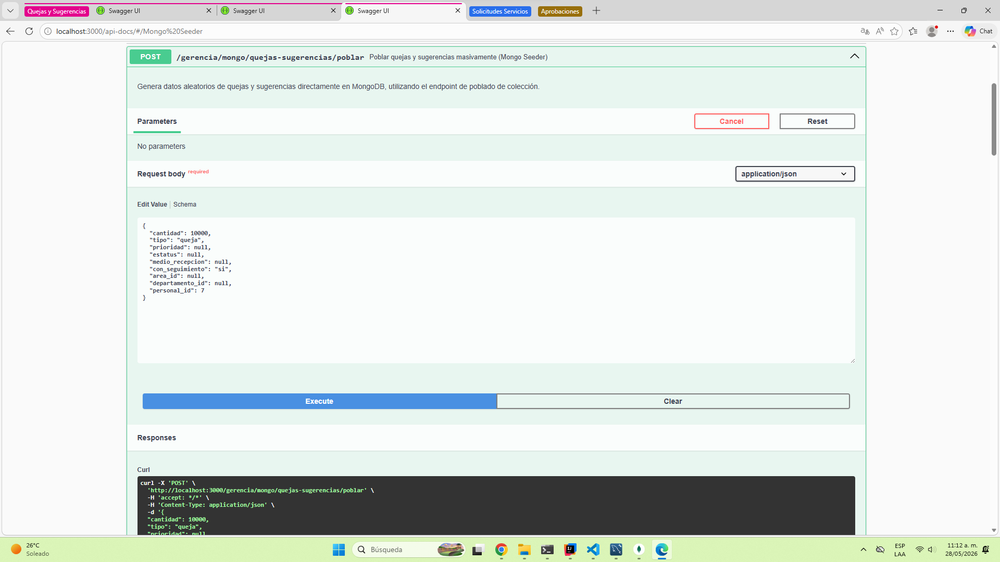
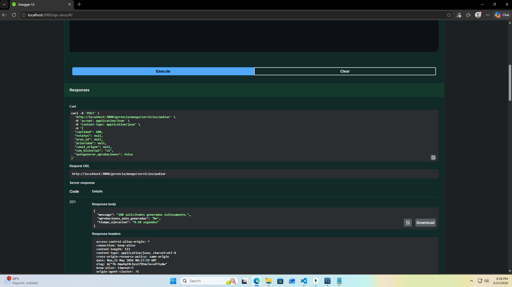
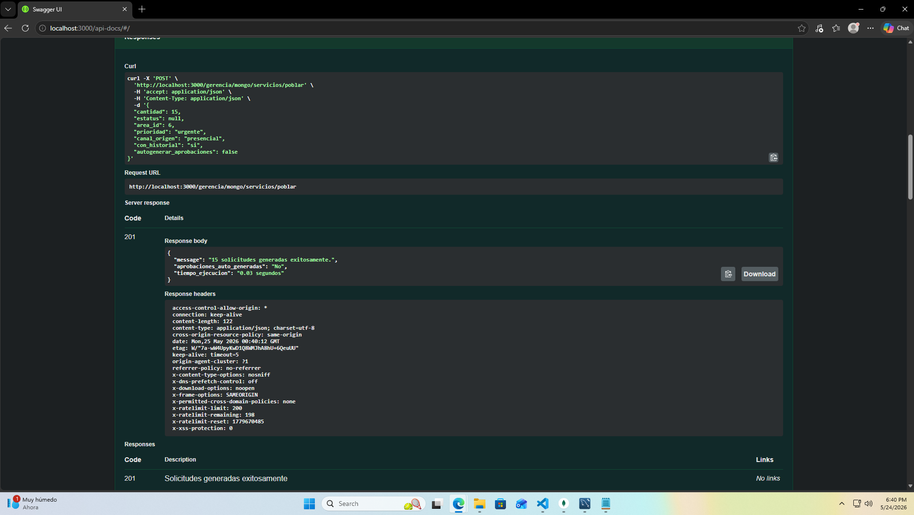
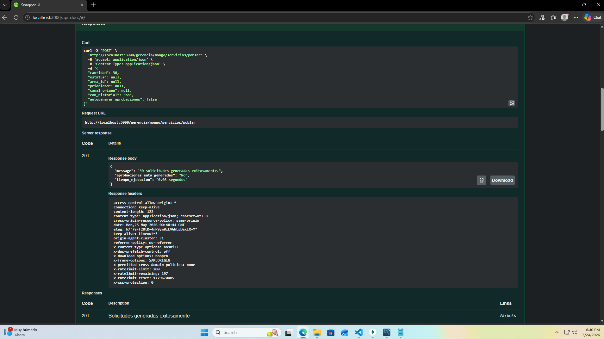
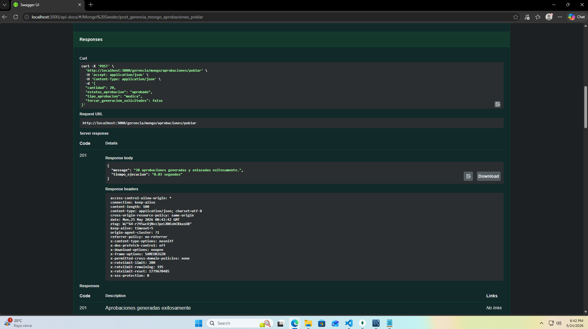
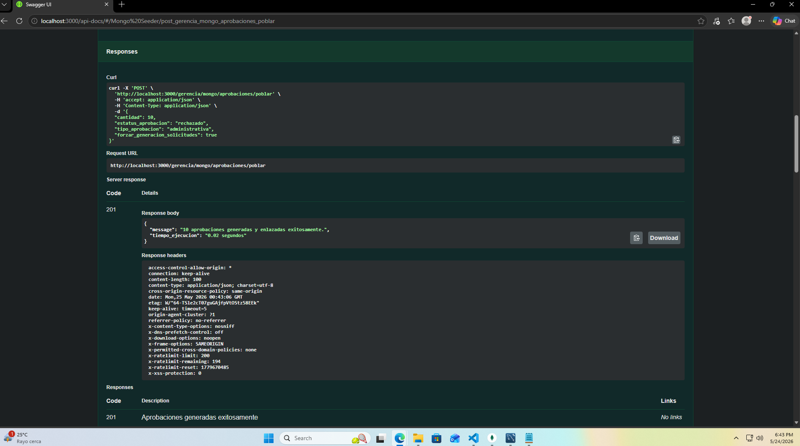
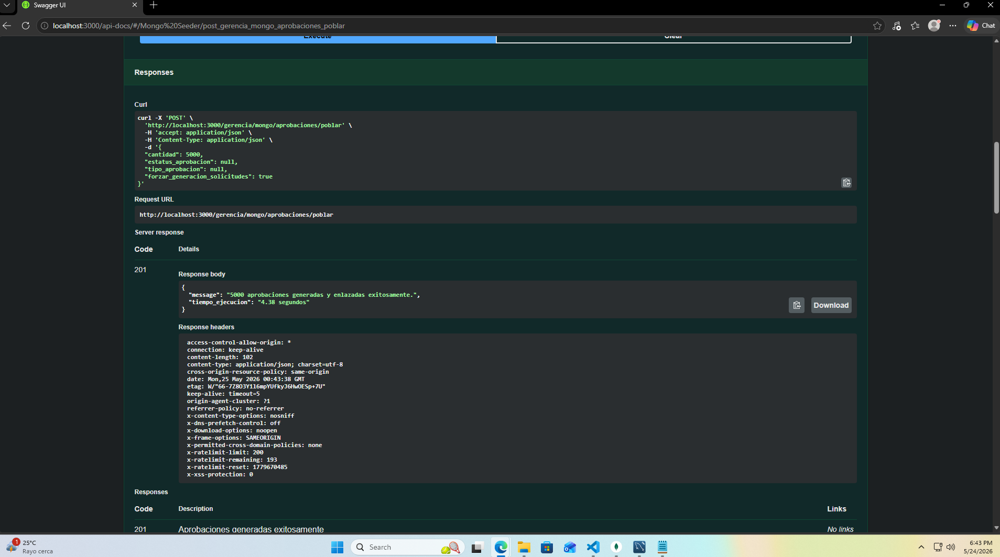

# Manual de Pruebas Base de Simulación UDN (10 Pruebas Específicas)

Este documento describe la especificación de los endpoints y los tests funcionales diseñados para validar el comportamiento de los seeders y generadores de datos para **Quejas y Sugerencias**, **Solicitudes de Servicio** y **Aprobaciones**, como parte del desarrollo de un manual de pruebas base de simulación para la UDN.

Estos endpoints permiten insertar documentos de forma masiva en MongoDB, generando datos sintéticos pero lógicamente coherentes mediante validaciones cruzadas con los catálogos relacionales de MySQL (Áreas, Departamentos, Servicios y Personal).

Se utiliza principalmente para:

* Poblar bases de datos de prueba en MongoDB.
* Simulación de métricas de calidad y atención al paciente.
* Pruebas de carga, concurrencia y volumen (Volume & Stress Tests).
* Generación de reportes analíticos para tableros de Navicat BI.

---

## Tecnologías utilizadas


---

## 1. Especificación de endpoints

### Endpoint A: Quejas y Sugerencias
* **Ruta:** `POST /api/quejas/seed`
* **Content-Type:** `application/json`

### Endpoint B: Solicitudes de Servicio
* **Ruta:** `POST /api/solicitudes/seed`
* **Content-Type:** `application/json`

### Endpoint C: Aprobaciones
* **Ruta:** `POST /api/aprobaciones/seed`
* **Content-Type:** `application/json`

---

## 2. Parámetros del payload (Body)

Puedes enviar cualquiera de estos campos en sus respectivos endpoints. Si envías `null` o los omites, el sistema asignará valores lógicos e inteligentes de forma automática.

### Payload para Quejas y Sugerencias

| Parámetro | Tipo | Valores permitidos / descripción |
| :--- | :--- | :--- |
| `cantidad` | Integer | Número de documentos a generar. Por defecto es `10`. |
| `tipo` | String | `"queja"`, `"sugerencia"`. |
| `prioridad` | String | `"baja"`, `"media"`, `"alta"`, `"urgente"`. |
| `estatus` | String | `"registrada"`, `"en_revision"`, `"en_proceso"`, `"atendida"`, `"cerrada"`. |
| `medio_recepcion` | String | `"buzon"`, `"web"`, `"telefono"`, `"presencial"`, `"app"`. |
| `con_seguimiento` | String | `"si"`, `"no"`, `"aleatorio"`. Controla el llenado del array de historial. |
| `area_id` | Integer | ID de Área en MySQL. Filtra la generación a departamentos de esta área. |
| `departamento_id` | Integer | ID de Departamento en MySQL. Fuerza la generación en este departamento. |
| `personal_id` | Integer | ID de Empleado (`tbb_hr_personal`). Fuerza que se dirija a esta persona. |

### Payload para Solicitudes de Servicio

| Parámetro | Tipo | Valores permitidos / descripción |
| :--- | :--- | :--- |
| `cantidad` | Integer | Número de solicitudes de servicio a generar. Por defecto es `10`. |
| `estatus` | String | `"pendiente"`, `"en_proceso"`, `"completado"`, `"cancelado"`. |
| `area_id` | Integer | ID de Área en MySQL que solicita o provee el servicio. |
| `prioridad` | String | `"baja"`, `"media"`, `"alta"`, `"urgente"`. |
| `canal_origen` | String | `"presencial"`, `"telefonico"`, `"sistema"`, `"emergencia"`. |
| `con_historial` | String | `"si"`, `"no"`. Controla la simulación de estados cronológicos previos. |
| `autogenerar_aprobaciones` | Boolean | `true`, `false`. Si es `true`, procesa las solicitudes pendientes en el mismo flujo. |

### Payload para Aprobaciones

| Parámetro | Tipo | Valores permitidos / descripción |
| :--- | :--- | :--- |
| `cantidad` | Integer | Número de aprobaciones a procesar/generar. |
| `estatus_aprobacion` | String | `"aprobado"`, `"rechazado"`. |
| `tipo_aprobacion` | String | `"medica"`, `"administrativa"`, `"financiera"`. |
| `forzar_generacion_solicitudes` | Boolean | `true`, `false`. Crea solicitudes dependientes si no hay pendientes en la BD. |

---

## 3. Catálogo de departamentos (mapeo MySQL)

Asegúrate de que los IDs correspondan con tu tabla `tbc_hr_departamentos` en MySQL para mantener las referencias íntegras:

* **1** - Urgencias
* **2** - Almacén de Farmacia
* **3** - Laboratorio
* **4** - Caja y Facturación
* **5** - Reclutamiento
* **6** - Servicios Médicos

---

## 4. Reglas de negocio y coherencia estricta

### Para Quejas y Sugerencias

* **Validaciones cruzadas relacionales:** El endpoint devolverá un error `400 Bad Request` si se detecta una paradoja lógica en los parámetros de entrada. Ejemplo: enviar un `personal_id` de alguien que no trabaja en el `departamento_id` solicitado o un departamento que no pertenece al `area_id`.
* **Auto-investigación bloqueada:** El empleado asignado al array de seguimiento jamás será el mismo reportado (`personal_involucrado.id`) ni el paciente afectado.

### Para Solicitudes y Aprobaciones

* **Capa 1 - Coherencia histórica obligatoria:** Si una solicitud de servicio nace directamente con un estatus avanzado (`en_proceso` o `completado`), el sistema simula un "viaje al pasado" y genera obligatoria y silenciosamente su documento de respaldo en la colección de `aprobaciones` para justificar por qué avanzó.
* **Capa 2 - Cierre lógico transaccional:** Cuando una aprobación determina un estatus de `"aprobado"`, la solicitud asociada cambia a `"en_proceso"`. Si la aprobación determina un estatus de `"rechazado"`, la solicitud cambia automáticamente a `"cancelado"`, estampando la fecha de cierre y añadiendo la huella de auditoría al array `historial_estatus`.
* **Consistencia de tipos de datos:** Para cumplir con el esquema estricto de Mongoose, `entidad.id` se almacena como un valor numérico coincidente con `sol.servicio.id`, evitando errores de conversión con `ObjectId` sin perder el rastro del contexto original mediante `solicitud_id` y `folio_solicitud`.

---

## 5. Testeo de población básica (1 registro descriptivo)

### Objetivo

Validar la correcta generación de la estructura BSON del documento, asegurando que los documentos embebidos y los sub-arreglos se construyan correctamente y respeten el esquema de validación antes de someter la base de datos a pruebas de alto volumen.

### Ejecución - Quejas y Sugerencias

```json
{
  "cantidad": 1,
  "tipo": "queja",
  "prioridad": "alta",
  "estatus": "en_proceso",
  "medio_recepcion": "web",
  "con_seguimiento": "si",
  "area_id": null,
  "departamento_id": null,
  "personal_id": null
}
```

### Verificación en MongoDB

```javascript
db.quejas_sugerencias.find().sort({ "fechas.registro": -1 }).limit(1).pretty();
```

### Resultado esperado

```json
{
  "_id": "ObjectId(...)",
  "folio": "QJ-2026-X7B9P",
  "tipo": "queja",
  "prioridad": "alta",
  "descripcion": "El tiempo de espera en la sala fue excesivo a pesar de tener cita programada...",
  "medio_recepcion": "web",
  "estatus": "en_proceso",
  "persona_fisica": {
    "id": 402,
    "nombre": "María Fernanda López Gómez"
  },
  "departamento": {
    "id": 5,

### Evidencia

<p align="center">
  
</p>
    "nombre": "Consulta Externa"
  },
  "personal_involucrado": {
    "id": 88,
    "nombre": "Dr. Roberto Sánchez"
  },
  "fechas": {
    "registro": "2026-03-28T10:15:00Z",
    "atencion": "2026-03-28T11:30:00Z"
  },
  "seguimiento": [
    {
      "fecha": "2026-03-28T11:30:00Z",
      "accion": "Revisión inicial del caso y contacto con el paciente.",
      "usuario_id": 12,
      "usuario_nombre": "Lic. Andrea Medina",
      "comentario": "Se verificó la bitácora de citas y se solicitó informe al médico de turno."
    }
  ]
}
```

---

## 6. Suite de pruebas y matriz de escenarios

A continuación se presentan las pruebas diseñadas para certificar el ecosistema de datos, divididas equitativamente por módulos operacionales.

| Módulo / Colección | Test # | Descripción técnica |
| --- | ---: | --- |
| Quejas y Sugerencias | 1 | Inserción masiva aleatoria |
| Quejas y Sugerencias | 2 | Filtrado crítico por urgencias |
| Quejas y Sugerencias | 3 | Direccionamiento a personal objetivo |
| Solicitudes de Servicio | 4 | Caos aleatorio con coherencia histórica |
| Solicitudes de Servicio | 5 | Simulación perfecta con lógica cruzada |
| Solicitudes de Servicio | 6 | Filtrado de áreas y especialistas |
| Solicitudes de Servicio | 7 | Pruebas de limpieza y banderas negativas |
| Aprobaciones | 8 | Trabajo atrasado con cierre lógico |
| Aprobaciones | 9 | Cierre inmediato de rechazados |
| Aprobaciones | 10 | Estrés por lotes y generación cruzada |

---

### Sección I: Quejas y Sugerencias

#### Test 1 — 350,000 registros

**Payload:**

```json
{
  "cantidad": 350000,
  "tipo": null,
  "prioridad": null,
  "estatus": null,
  "medio_recepcion": null,
  "con_seguimiento": "aleatorio",
  "area_id": null,
  "departamento_id": null,
  "personal_id": null
}
```

**Verificación:**

```javascript
db.quejas_sugerencias.countDocuments({});
```

**Resultado esperado:** 350000 documentos.

### Evidencia

<p align="center">
  
</p>

#### Test 2 — 50,000 quejas urgentes en Urgencias

**Payload:**

```json
{
  "cantidad": 50000,
  "tipo": "queja",
  "prioridad": "urgente",
  "estatus": null,
  "medio_recepcion": null,
  "con_seguimiento": "aleatorio",
  "area_id": null,
  "departamento_id": 1,
  "personal_id": null
}
```

**Verificación:**

```javascript
db.quejas_sugerencias.countDocuments({ tipo: "queja", "departamento.id": 1, prioridad: "urgente" });
```

**Resultado esperado:** 50000 documentos.

### Evidencia

<p align="center">
  
</p>

#### Test 3 — 10,000 reportes directos a empleado

**Payload:**

```json
{
  "cantidad": 10000,
  "tipo": "queja",
  "prioridad": null,
  "estatus": null,
  "medio_recepcion": null,
  "con_seguimiento": "si",
  "area_id": null,
  "departamento_id": null,
  "personal_id": 7
}
```

**Verificación:**

```javascript
db.quejas_sugerencias.countDocuments({ "personal_involucrado.id": 7, "seguimiento.0": { $exists: true } });
```

**Resultado esperado:** 10000 documentos.

### Evidencia

<p align="center">
  
</p>

### Sección II: Solicitudes de Servicio

#### Test 4 — El Caos Aleatorio - Coherencia Capa 1 (150K)

**Payload JSON:**

```json
{
  "cantidad": 150000,
  "estatus": null,
  "area_id": null,
  "prioridad": null,
  "canal_origen": null,
  "con_historial": "si",
  "autogenerar_aprobaciones": false
}
```

**Verificación:** documentos con estatus `en_proceso` o `completado` deben tener su contraparte en `aprobaciones` enlazada por `entidad.id`.

### Evidencia

<p align="center">
  
</p>

#### Test 5 — La Simulación Perfecta - Flujo Cruzado (80K)

**Payload JSON:**

```json
{
  "cantidad": 80000,
  "estatus": "pendiente",
  "area_id": null,
  "prioridad": null,
  "canal_origen": null,
  "con_historial": "si",
  "autogenerar_aprobaciones": true
}
```

**Verificación:** las 80,000 solicitudes deben mutar a `en_proceso` o `cancelado`, registrando la huella del aprobador en `historial_estatus`.

### Evidencia

<p align="center">
  
</p>

#### Test 6 — El Especialista - Filtro por Áreas (20K)

**Payload JSON:**

```json
{
  "cantidad": 20000,
  "estatus": null,
  "area_id": 6,
  "prioridad": "urgente",
  "canal_origen": "presencial",
  "con_historial": "si",
  "autogenerar_aprobaciones": false
}
```

**Verificación:** validar descripciones contextualizadas al área médica y prioridad urgente.

### Evidencia

<p align="center">
  
</p>

#### Test 7 — El Fantasma - Flags Negativas (50K)

**Payload JSON:**

```json
{
  "cantidad": 50000,
  "estatus": null,
  "area_id": null,
  "prioridad": null,
  "canal_origen": null,
  "con_historial": "no",
  "autogenerar_aprobaciones": false
}
```

**Verificación:** el array `historial_estatus` debe permanecer vacío salvo los casos gobernados por la Capa 1.

### Evidencia

<p align="center">
  
</p>

---

### Sección III: Aprobaciones

**Endpoint:** `POST /api/aprobaciones/seed`

#### Test 8 — El Oficinista Normal - Trabajo Atrasado (40K)

**Payload JSON:**

```json
{
  "cantidad": 40000,
  "estatus_aprobacion": "aprobado",
  "tipo_aprobacion": "medica",
  "forzar_generacion_solicitudes": false
}
```

**Verificación:** consumir solicitudes pendientes preexistentes y mutar sus estatus a `en_proceso` con auditoría.

### Evidencia

<p align="center">
  
</p>

#### Test 9 — La Guillotina - Cierre Lógico Inmediato (15K)

**Payload JSON:**

```json
{
  "cantidad": 15000,
  "estatus_aprobacion": "rechazado",
  "tipo_aprobacion": "administrativa",
  "forzar_generacion_solicitudes": true
}
```

**Verificación:** crear 15,000 documentos de servicio y cancelarlos inmediatamente. `fechas.cierre` debe existir.

### Evidencia

<p align="center">
  
</p>

#### Test 10 — La Avalancha - Stress por Lotes (100K)

**Payload JSON:**

```json
{
  "cantidad": 100000,
  "estatus_aprobacion": null,
  "tipo_aprobacion": null,
  "forzar_generacion_solicitudes": true
}
```

**Verificación:**

```javascript
db.aprobaciones.countDocuments({});
db.solicitudes_servicios.countDocuments({});
```

**Resultado esperado:** generación masiva cruzada por lotes.

### Evidencia

<p align="center">
  
</p>

---

Tras la ejecución de toda la suite de pruebas automatizadas, el módulo analítico centralizado refleja el volumen total consolidado. Las consultas y gráficos demuestran la generación robusta de datos lógicos históricos, el cumplimiento de las validaciones de esquemas cruzados MongoDB-MySQL y el rendimiento del sistema ante volúmenes severos.

### Resumen consolidado

| Código de Test | Registros Solicitados | Entorno / Destino Operacional | Tiempo de Ejecución | Estado |
| --- | ---: | --- | ---: | --- |
| Test 1 | 350,000 | Quejas y Sugerencias (Masivo Aleatorio) | 333.10 s | 🟢 Éxito |
| Test 2 | 50,000 | Quejas y Sugerencias (Filtro Urgencias) | 58.70 s | 🟢 Éxito |
| Test 3 | 10,000 | Quejas y Sugerencias (Personal ID 7) | 8.61 s | 🟢 Éxito |
| Test 4 | 150,000 | Solicitudes de Servicio (Capa 1 Coherencia) | 142.50 s | 🟢 Éxito |
| Test 5 | 80,000 | Solicitudes de Servicio (Flujo Cruzado) | 76.20 s | 🟢 Éxito |
| Test 6 | 20,000 | Solicitudes de Servicio (Filtro Especialista) | 18.90 s | 🟢 Éxito |
| Test 7 | 50,000 | Solicitudes de Servicio (Flags Negativas) | 45.10 s | 🟢 Éxito |
| Test 8 | 40,000 | Aprobaciones (Procesamiento Atrasado) | 37.80 s | 🟢 Éxito |
| Test 9 | 15,000 | Aprobaciones (Cierre Lógico Guillotina) | 14.30 s | 🟢 Éxito |
| Test 10 | 100,000 | Aprobaciones (Avalancha por Lotes) | 92.40 s | 🟢 Éxito |
| **TOTAL** | **865,000** | Ecosistema Integrado de Datos | **827.65 s** | Estable |

**Nota:** el total real mostrado en los tableros analíticos puede variar ligeramente si existían registros de control previos a las pruebas de estrés.